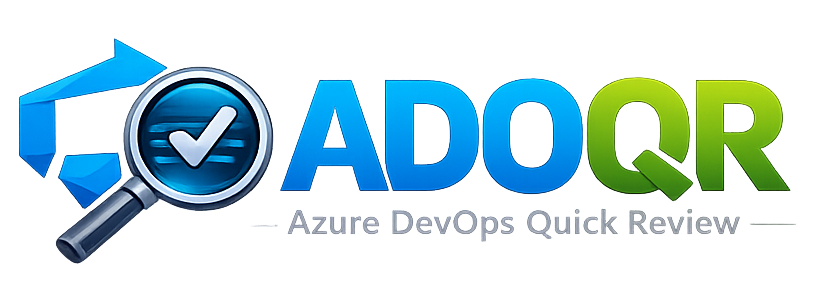
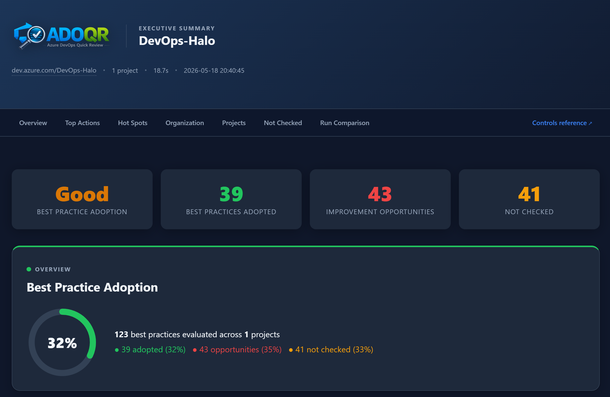
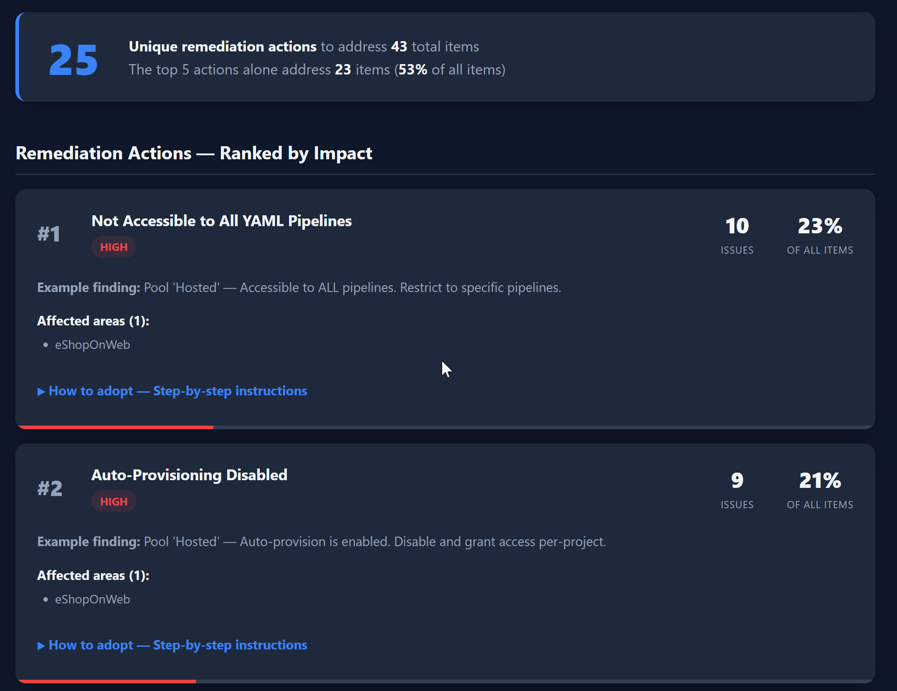

<p align="center">

</p>

# Azure DevOps Quick Review

Azure DevOps Quick Review (**adoqr**) is a PowerShell-based tool that analyzes
Azure DevOps organizations and projects to evaluate adherence to
**Azure DevOps best practices** and Microsoft recommendations. It produces a
comprehensive review of your ADO resources so you can easily identify
misconfigured settings, gaps, and high-impact areas for improvement.

This is a **sister tool to** [GitHub Quick Review (ghqr)](https://github.com/microsoft/ghqr)
— same idea, same shape of output, but purpose-built for Azure DevOps.

A bundled **GitHub Copilot skill** is included to help you refine the script,
interpret results, and explore remediation options through natural language
in VS Code.



## What adoqr Checks

> **Browse the full controls reference:** [Controls reference →](https://microsoft.github.io/adoqr/controls.html)
> — a searchable catalogue of every control evaluated by adoqr, with descriptions,
> step-by-step remediation, and links to Microsoft Learn.

Azure DevOps Quick Review evaluates your ADO resources across the following
areas, with 120+ individual best-practice checks:

| Category | Scope | Examples |
|---|---|---|
| Identity & Access | Organization, Project | AAD/Entra ID auth, guest and external users, admin group sizing, service-account hygiene |
| Governance | Organization, Project | Public projects, third-party OAuth, extension review, audit log streaming |
| Pipelines & Actions | Project, Pipeline | Inherited permissions, fork protections, CI triggers, approvals, agent pools |
| Secrets & Credentials | Pipeline, Repo | Build/release secrets, credential scanning, secure files, variable groups |
| Repos & Branch Protection | Project, Repo | Branch policies, required reviewers, build validation, inactive repos |
| Service Connections | Project | Project scoping, recipient access, federated credentials |
| Resources | Project | Variable groups, secure files, environments, feeds |
| PAT Hygiene | User | Critical scopes, full-access tokens, expiry |

## Scan Results

The output of an adoqr run includes:

- **Recommendations** — prioritized findings with severity, affected areas, and a step-by-step fix
- **Organization summary** — a single view of org-level posture
- **Per-project reports** — best-practice adoption for each project
- **Executive dashboard** — KPI cards, an adoption ring, and a project comparison table
- **Not checked explanations** — reason categories and scoped details for controls that need permissions, prerequisites, configuration data, or manual review
- **Remediation plan** — every unique action ranked by impact, with links to Microsoft Learn

Each run creates a **timestamped folder** under `assessments/` (e.g.
`assessments/myorg-2026-04-12-143022/`) so previous results are preserved.
The folder contains:

| File | Description |
|---|---|
| `*-org-assessment.md` | Organization-level Markdown report |
| `*-<project>-assessment.md` | Per-project Markdown reports |
| `*-executive-summary.html` | Visual HTML dashboard with KPIs, adoption ring, and project comparison |
| `*-remediation-plan.html` | Prioritized remediation actions ranked by impact, with step-by-step fix instructions and Microsoft Learn links |

## Installation

### Prerequisites

- [PowerShell](https://docs.microsoft.com/powershell/) 5.0+ (PowerShell 7+ recommended for parallel execution)
- [Azure CLI](https://learn.microsoft.com/cli/azure/install-azure-cli) v2.81.0+
- Azure DevOps Azure CLI extension (`azure-devops`) - installed automatically on first run if missing
- An Azure CLI session authenticated with access to the target ADO organization (`az login`)
- [GitHub Copilot](https://marketplace.visualstudio.com/items?itemName=GitHub.copilot) extension for VS Code (optional, for skill-assisted workflows)

### Clone Repository

```powershell
git clone https://github.com/microsoft/adoqr.git
```

### Run PowerShell Script

```powershell
# 1. Sign in
az login

# 2. Review an organization
.\invoke-adoqr.ps1 -Organization "MyOrg"

# 3. Review specific projects only
.\invoke-adoqr.ps1 -Organization "MyOrg" -Project "WebApp","API"
```

Reports are saved to a timestamped subfolder under `assessments/`. The
executive HTML summary auto-opens in your browser when the assessment
completes. Auto-opening is skipped automatically in CI and other
non-interactive environments; set `ADOQR_NO_OPEN=1` to suppress it anywhere.

If the Azure DevOps Azure CLI extension is not already installed, adoqr
installs it automatically before the review starts.

### Configuration File (optional)

By default adoqr flags repositories and projects as inactive after **180 days**
without a commit. If you want a different threshold, create a settings file
named `adoqr.settings.psd1` in the same directory as `invoke-adoqr.ps1`:

```powershell
# Copy the example file and uncomment / edit the values you want to change
Copy-Item adoqr.settings.example.psd1 adoqr.settings.psd1
```

Edit the new file and uncomment the setting you want to override, for example:

```powershell
@{
    # Flag repos / projects with no commits in the last 90 days (default: 180)
    InactiveRepoDays = 90
}
```

`adoqr.settings.psd1` is listed in `.gitignore` so your local overrides are
never committed. All settings are optional — only add the keys you want to
change.

## Usage

### Authentication

adoqr supports the following authentication method:

- **Azure CLI session** — the script obtains an Azure DevOps bearer token from
  the active `az` session. No PAT is required.

```powershell
# Interactive sign-in (recommended)
az login

# Confirm the active subscription / tenant
az account show
```

The signed-in identity needs at least **Project Collection Valid Users** access
to the target organization. For full coverage of admin-group and audit checks,
the identity should be a **Project Collection Administrator**.

The `-IncludeGraphCheck` switch additionally calls Microsoft Graph and requires
the `User.Read.All` permission to be consented for the same identity.

### Running Assessments

| Parameter | Required | Description |
|---|---|---|
| `-Organization` | Yes | The ADO organization URL (e.g. `https://dev.azure.com/MyOrg`) or short name (`MyOrg`). |
| `-Project` | No | One or more project names to assess. If omitted, all projects are assessed. |
| `-OutputPath` | No | Directory for report files. Defaults to `assessments/` in the repo root. |
| `-MaxParallel` | No | Maximum number of projects to assess concurrently. Default `3`. Requires PowerShell 7+ for parallel execution; PowerShell 5.1 falls back to sequential execution. Recommended range: `2`-`4` to reduce the chance of Azure DevOps throttling. |
| `-IncludeGraphCheck` | No | Cross-references ADO users with Entra ID via Microsoft Graph API to detect deleted or disabled AAD users (USER-02). Requires `User.Read.All` Graph permissions via `az login`. |
| `-OutputFormat` | No | One or more output formats: `markdown`, `html`, `json`, `all`. Defaults to `markdown,html`. Pass `json` or `all` to additionally write a structured `<org>-scan.json` document for downstream tooling and Copilot/MCP integrations. |

```powershell
# Write reports to a custom directory
.\invoke-adoqr.ps1 -Organization "MyOrg" -OutputPath "C:\Reports"

# Cross-check users against Entra ID
.\invoke-adoqr.ps1 -Organization "MyOrg" -IncludeGraphCheck
```

### Output Formats

By default adoqr produces two canonical artifacts: per-org and per-project
**Markdown** reports plus an **HTML** executive dashboard and remediation plan.
These remain on for every run and are the recommended way to consume results.

For automation, pipelines, and Copilot/MCP integrations, opt in to a structured
JSON document with `-OutputFormat json` (or `-OutputFormat all`):

```powershell
# Markdown + HTML + JSON (single <org>-scan.json next to the HTML reports)
.\invoke-adoqr.ps1 -Organization "MyOrg" -OutputFormat all
```

The JSON document contains every control with `id`, `status`, `severity`,
`category`, `control`, `finding`, and `scope` (organization vs. project),
plus aggregate `summary` counts and per-project rollups. The full schema is
documented in [`schemas/scan.schema.json`](schemas/scan.schema.json) and is
versioned via `schemaVersion`.

### Parallel Execution

When `-MaxParallel` is set to a value greater than 1, the script runs the
assessment concurrently at three levels:

1. **Org + Projects** — The organization assessment runs as a background thread
   alongside all project assessments.
2. **Project-level** — Up to `-MaxParallel` projects are assessed simultaneously.
3. **Check-level** — Within each project, all 10 check categories (pipelines,
   repos, service connections, etc.) run as concurrent thread jobs.

```powershell
# Review all projects, 5 at a time
.\invoke-adoqr.ps1 -Organization "MyOrg" -MaxParallel 5
```

Falls back to sequential execution automatically on PowerShell 5.1 or when
only one project is being assessed.

## Troubleshooting

### Common Issues

For deeper diagnostics, re-run with PowerShell's built-in `-Verbose` switch
(equivalent to ghqr's `--debug` flag):

```powershell
.\invoke-adoqr.ps1 -Organization "MyOrg" -Verbose
```

### Authentication Errors

If you receive `401 Unauthorized` or `403 Forbidden` errors:

1. Verify your `az` session is active: `az account show`.
2. Re-run `az login` and select the tenant that owns the ADO organization.
3. Confirm the signed-in identity has access to the org (Project Collection
   Valid Users at minimum, Project Collection Administrators for full coverage).
4. For `-IncludeGraphCheck`, ensure the identity has the `User.Read.All`
   Microsoft Graph permission consented.

### Rate Limiting

Azure DevOps enforces a **200 TSTU (throughput unit) limit per user** in a
sliding 5-minute window. The script monitors `X-RateLimit-Remaining` and
`X-RateLimit-Limit` response headers on every API call and **proactively
throttles** when usage approaches the limit:

| Remaining capacity | Action |
|---|---|
| ≤ 10% | Automatic 2-second pause + console warning |
| 0% (429 response) | Honors `Retry-After` header with exponential backoff |

> **Note:** Higher `-MaxParallel` values increase API request volume and may
> trigger rate limiting sooner. If you see throttle warnings, reduce
> `-MaxParallel` or run sequentially. For large organizations (50+ projects),
> start with `-MaxParallel 3` and increase if no warnings appear.

## Remediation Plan

After the review completes, a **remediation plan** is automatically generated
alongside the executive summary. It provides a prioritized, actionable path to
adopting the recommended best practices.

### How It Works

1. All findings flagged for improvement are parsed from the per-project and org Markdown reports.
2. Items are grouped by control name and ranked by **severity** (High → Medium
   → Low), then by **frequency** (most widespread items first).
3. Two outputs are produced:
   - A **Top 5 Remediation Actions** summary in the executive HTML report, showing
     the highest-impact actions and how many items each one resolves.
   - A **full Remediation Plan** (`*-remediation-plan.html`) with every unique
     remediation action.

### What Each Remediation Card Shows

| Section | Description |
|---|---|
| **Severity badge** | High / Medium / Low |
| **Issue count** | How many times this best practice was not adopted across the org and all projects |
| **% of all items** | The proportion of total improvement opportunities this single action addresses |
| **Affected areas** | Which projects (or Organization) are impacted |
| **Example finding** | A representative finding from the review |
| **How to adopt** | Expandable step-by-step instructions (click to reveal) |
| **Accept risk** | A justification text box that lets reviewers move a control into the **Accepted Controls** tab when the business accepts the risk |
| **Documentation link** | Direct link to the relevant Microsoft Learn page |

### Using the Remediation Plan

- Open `*-remediation-plan.html` in a browser — it links back to the executive
  summary.
- Work through actions **top to bottom** for maximum impact. The top 5 actions
  typically resolve 50–80% of all items.
- Click **"How to adopt"** on any card to expand the numbered steps showing
  exactly where to navigate in Azure DevOps and what to change.
- If a control has an approved exception, click **"Accept risk"**, enter the
  business justification, and the card will move to the **Accepted Controls**
  tab with the recorded acceptance date. Accepted controls are stored per
  organization in the browser and reused by future remediation reports opened
  in the same browser.
- Use **"Undo acceptance"** in the **Accepted Controls** tab to move a control
  back into the active remediation list. The executive summary and **Top 5
  Remediation Actions** update locally to exclude accepted controls from active
  improvement counts.
- After applying changes, re-run adoqr to verify the items are resolved.



## Copilot Skill

The `.github/skills/ado-assessment/` folder contains a GitHub Copilot skill that
provides context-aware assistance when working with adoqr scripts and results.
Use it to:

- Understand what specific best practices check and why they matter
- Get help refining or extending the script
- Interpret report findings and explore remediation steps
- Generate Azure CLI commands for ad-hoc verification

### Adding the Skill

**Option 1 — Use from this repo.** The skill is detected automatically when you
open this workspace in VS Code with GitHub Copilot installed.

**Option 2 — Copy into another repo.** Copy `.github/skills/ado-assessment/` into
your target repository's `.github/skills/` directory.

**Option 3 — Install as a VS Code user-level skill.** Place the skill folder under
your VS Code user data directory for cross-workspace availability:

- **Windows:** `%APPDATA%\Code\User\.github\skills\ado-assessment\`
- **macOS:** `~/Library/Application Support/Code/User/.github/skills/ado-assessment/`
- **Linux:** `~/.config/Code/User/.github/skills/ado-assessment/`

### Example Copilot Prompts

- "What does ADO_Organization_AuthN_Use_AAD_Auth check?"
- "Help me add a new best-practice check to adoqr"
- "Explain the findings in the latest review report"
- "How do I adopt the guest user best practices?"

## Thanks to everyone who has contributed!

<a href="https://github.com/microsoft/adoqr/graphs/contributors">
  
</a>

## Acknowledgements

- [AzSK.ADO Security Scanner](https://github.com/azsk/ADOScanner) by the AzSK team
- [ADOScanner Documentation](https://github.com/azsk/ADOScanner-docs)
- [GitHub Quick Review (ghqr)](https://github.com/microsoft/ghqr) — the sister tool whose shape and tone this project mirrors

## License

MIT
